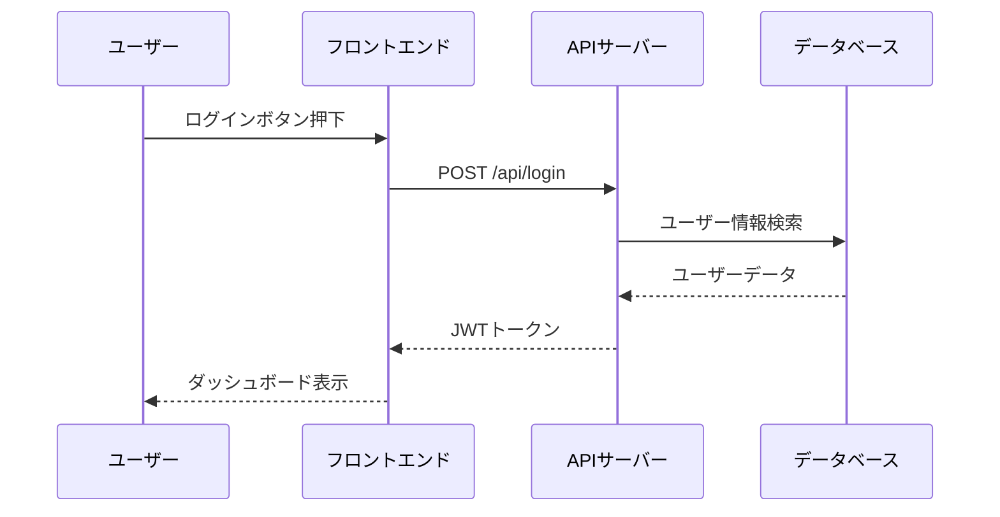
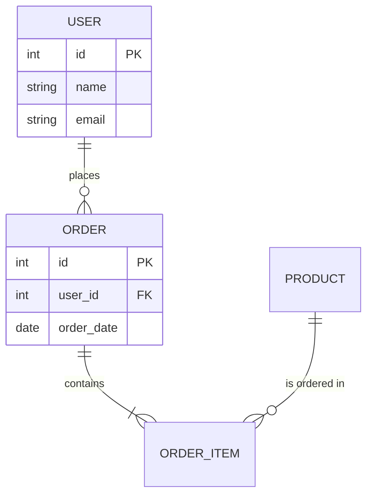

# 第1章：設計工程の概要

## この章のゴール

- ソフトウェア開発における設計工程の位置づけと重要性を理解する
- 各設計フェーズ（要件定義・基本設計・詳細設計）の役割を把握する
- 設計ドキュメントの種類と目的を知る
- 良い設計ドキュメントの特徴を理解する

---

## 1.1 設計工程とは

### ソフトウェア開発のライフサイクルにおける位置づけ

設計工程は、「何を作るか」を決めた後に「どう作るか」を定義するフェーズです。

```
要件定義 → 【設計】 → 実装 → テスト → リリース → 保守
             ↑ ここ
```

設計工程では、要件を実現するためのシステムの構造・動作・データの流れを具体的に定義します。

### なぜ設計が必要なのか

設計なしにいきなりコーディングに入ると、以下のような問題が発生します。

| 問題 | 具体例 |
|------|--------|
| **手戻りの増大** | 実装後に「そもそも構造が間違っている」と気づく |
| **品質の低下** | 場当たり的な実装でバグが増える |
| **コミュニケーション不足** | チームメンバー間で認識がずれる |
| **保守性の低下** | 後から変更しにくいシステムになる |
| **見積もりの困難** | 何をどう作るか不明確なまま工数を見積もれない |

> **現場のプロの知見**: 「設計に1時間かけることで、実装とデバッグの10時間を節約できる」と言われます。特にチーム開発では、設計ドキュメントが共通認識の土台になります。

---

## 1.2 設計工程のフェーズ

ソフトウェア設計は一般的に以下のフェーズに分かれます。

```
要件定義
  │  「何を作るか」を決める
  ▼
基本設計（外部設計）
  │  「システム全体の構造」を決める
  │  ユーザーから見える部分を定義
  ▼
詳細設計（内部設計）
  │  「各モジュールの内部構造」を決める
  │  開発者向けの詳細を定義
  ▼
実装（コーディング）
```

### 各フェーズの比較

| フェーズ | 対象者 | 粒度 | 主な成果物 |
|---------|--------|------|-----------|
| **要件定義** | 顧客・ビジネス側 | 粗い | 要件定義書、ユースケース |
| **基本設計** | 顧客・開発チーム | 中程度 | システム構成図、画面設計書 |
| **詳細設計** | 開発チーム | 細かい | クラス図、シーケンス図、DB設計書 |

### ウォーターフォールとアジャイルでの設計の違い

**ウォーターフォール型:**
- 設計フェーズが明確に分離されている
- 設計書を完成させてからコーディングに進む
- ドキュメントが充実する傾向がある

**アジャイル型:**
- 設計と実装を繰り返し行う
- 必要最小限のドキュメントを作成する
- 「動くソフトウェア」を優先する

> **実務でのポイント**: アジャイルでも設計ドキュメントは必要です。ただし、形式や詳細度はプロジェクトに応じて調整します。「ドキュメントを書かない」のではなく「必要十分なドキュメントを書く」のがアジャイルの考え方です。

---

## 1.3 設計ドキュメントの種類

ソフトウェア開発で作成される主な設計ドキュメントを一覧にします。

### 設計ドキュメント一覧

| ドキュメント名 | フェーズ | 目的 | 主な読者 |
|--------------|---------|------|---------|
| **要件定義書** | 要件定義 | 機能・非機能要件の定義 | 顧客、PM、開発チーム |
| **システム構成図** | 基本設計 | システム全体の構造を図示 | 開発チーム、インフラ |
| **画面設計書** | 基本設計 | UI・画面遷移の定義 | デザイナー、フロントエンド |
| **API設計書** | 基本設計 | API仕様の定義 | フロント・バックエンド |
| **データベース設計書** | 基本設計〜詳細設計 | テーブル構造の定義 | バックエンド、DBA |
| **詳細設計書** | 詳細設計 | モジュール内部の処理ロジック | 開発者 |
| **テスト設計書** | 設計〜テスト | テスト方針と項目の定義 | QA、開発者 |

### ドキュメント間の関係

```
要件定義書
  ├── システム構成図
  ├── 画面設計書
  │     └── 画面遷移図
  ├── API設計書
  │     └── シーケンス図
  ├── データベース設計書
  │     ├── ER図
  │     └── テーブル定義書
  └── 詳細設計書
        ├── クラス図
        ├── シーケンス図
        └── 処理フロー図
```

---

## 1.4 良い設計ドキュメントの特徴

### 5つの原則

**1. 正確性（Accuracy）**
- 実際のシステムと一致していること
- 矛盾がないこと
- 曖昧な表現を避けること

**2. 完全性（Completeness）**
- 必要な情報が漏れなく記載されていること
- 例外ケースやエラーハンドリングも網羅すること

**3. 一貫性（Consistency）**
- 用語・記法が統一されていること
- ドキュメント間で矛盾がないこと

**4. 読みやすさ（Readability）**
- 対象読者に合った粒度・表現であること
- 図表を効果的に使うこと
- 構造が明確であること

**5. 保守性（Maintainability）**
- 更新しやすい構造であること
- バージョン管理されていること
- 変更履歴が追えること

### よくある間違い

| よくある間違い | 改善方法 |
|--------------|---------|
| 曖昧な表現「適切に処理する」 | 具体的に「ステータスコード400を返す」 |
| 図表なしの長文 | システム構成図やフローチャートで視覚化 |
| 更新されていない古い設計書 | 実装と同時にドキュメントも更新するルール |
| 対象読者が不明確 | 冒頭に「このドキュメントの対象読者」を明記 |
| 用語の不統一 | 用語集を作成し統一する |

---

## 1.5 設計ドキュメントの記法とツール

### よく使われる図の種類

| 図の種類 | 用途 | 使う場面 |
|---------|------|---------|
| **フローチャート** | 処理の流れを表現 | ビジネスロジック、バッチ処理 |
| **ER図** | データの関連を表現 | データベース設計 |
| **クラス図** | オブジェクトの構造と関連を表現 | 詳細設計 |
| **シーケンス図** | オブジェクト間のやり取りを時系列で表現 | API設計、処理フロー |
| **画面遷移図** | 画面間の遷移を表現 | UI設計 |
| **システム構成図** | サーバー・ネットワーク構成を表現 | インフラ設計 |

### 設計ドキュメント作成ツール

| カテゴリ | ツール例 | 特徴 |
|---------|---------|------|
| **ドキュメント** | Confluence、Notion、Google Docs | 共同編集、テンプレート |
| **作図** | draw.io、Mermaid、PlantUML | UML図、フローチャート |
| **API設計** | Swagger/OpenAPI、Stoplight | API仕様の標準化 |
| **ワイヤーフレーム** | Figma、Adobe XD | 画面設計、プロトタイプ |
| **DB設計** | dbdiagram.io、MySQL Workbench | ER図、DDL生成 |

### Mermaidによる図の例

Markdownの中で図を描けるMermaidは、設計ドキュメントで特に便利です。

**シーケンス図の例:**



**ER図の例:**



---

## 1.6 設計工程の進め方

### 一般的な進め方

```
1. 要件の確認・整理
   │
2. 設計方針の決定
   │  ・アーキテクチャスタイルの選択
   │  ・技術スタックの決定
   │  ・設計の粒度・ドキュメント範囲の決定
   │
3. 設計の実施
   │  ・各設計ドキュメントの作成
   │  ・図表の作成
   │
4. 設計レビュー
   │  ・チーム内レビュー
   │  ・顧客レビュー（基本設計）
   │
5. 設計の承認・ベースライン化
   │
6. 実装フェーズへの引き継ぎ
```

### 設計書作成の手順（実践的なアプローチ）

1. **まず全体像を描く** - システム構成図で大枠を把握
2. **ユーザー視点で整理** - 画面遷移図・ユースケースで機能を整理
3. **データを定義する** - ER図・テーブル定義でデータ構造を確定
4. **APIを定義する** - 画面とデータをつなぐインターフェースを設計
5. **処理ロジックを詳細化** - 各モジュールの内部設計を行う
6. **レビューで品質を担保** - チームでレビューし、指摘を反映する

---

## 1.7 設計ドキュメントのバージョン管理

### 変更履歴の管理

設計ドキュメントには必ず変更履歴を記録します。

```markdown
## 変更履歴

| バージョン | 日付 | 変更者 | 変更内容 |
|-----------|------|--------|---------|
| 1.0 | 2026-04-01 | 山田太郎 | 初版作成 |
| 1.1 | 2026-04-15 | 佐藤花子 | 画面設計の追記 |
| 2.0 | 2026-05-01 | 山田太郎 | 設計レビュー指摘対応 |
```

### Gitでの管理

設計ドキュメントもコードと同様にGitで管理するのが現代的なプラクティスです。

```
project-repo/
├── docs/
│   ├── requirements/     # 要件定義書
│   ├── basic-design/     # 基本設計書
│   ├── detail-design/    # 詳細設計書
│   └── images/           # 図表画像
├── src/                  # ソースコード
└── tests/                # テストコード
```

**メリット:**
- コードとドキュメントの変更を同時に追跡できる
- プルリクエストでレビューできる
- ブランチで設計変更を管理できる

---

## まとめ

| 概念 | ポイント |
|------|---------|
| 設計工程の位置づけ | 要件定義と実装の間で「どう作るか」を定義する |
| 設計フェーズ | 要件定義 → 基本設計 → 詳細設計の順で詳細化する |
| ドキュメントの種類 | 要件定義書、画面設計書、API設計書、DB設計書、詳細設計書 |
| 良いドキュメント | 正確・完全・一貫・読みやすい・保守しやすい |
| ツール | Mermaid、draw.io、Swagger等を活用する |
| バージョン管理 | Gitでコードとともに管理するのがベストプラクティス |

---

## 次章の予告

次章では、設計工程の最初のステップである「要件定義書」の作成方法を詳しく学びます。機能要件・非機能要件の定義方法、ユースケースの書き方を実践的に解説します。
