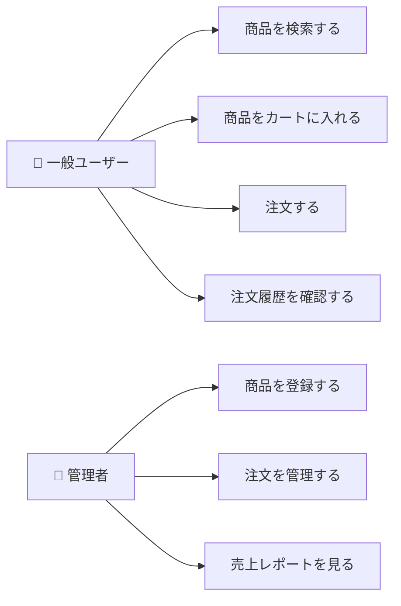

# 第2章：要件定義書

## この章のゴール

- 要件定義書の目的と構成を理解する
- 機能要件と非機能要件の違いを把握する
- ユースケース図・ユースケース記述の書き方を習得する
- 要件の優先度付けの手法を学ぶ

---

## 2.1 要件定義書とは

### 目的

要件定義書は、**システムが「何を」実現すべきかを定義するドキュメント**です。「どう作るか」ではなく「何を作るか」に焦点を当てます。

### 要件定義書の位置づけ

```
ビジネス要求
  │  「売上を20%増やしたい」（ビジネスゴール）
  ▼
要件定義書
  │  「商品検索機能を提供する」（システム要件）
  ▼
設計書
     「Elasticsearchで全文検索を実装する」（技術的解決策）
```

> **よくある間違い**: 要件定義の段階で技術的な解決策を書いてしまうこと。要件定義書は「何を実現するか」であり、「どう実現するか」は設計書に書きます。

### 要件定義書の基本構成

```markdown
1. はじめに
   1.1 目的
   1.2 スコープ
   1.3 用語定義
   1.4 参照文書
2. システム概要
   2.1 システムの背景
   2.2 システムの目的
   2.3 ステークホルダー
3. 機能要件
   3.1 ユースケース一覧
   3.2 各ユースケースの詳細
4. 非機能要件
   4.1 性能要件
   4.2 セキュリティ要件
   4.3 可用性要件
   4.4 保守性要件
5. 制約条件
6. 前提条件
7. 用語集
```

---

## 2.2 機能要件

### 機能要件とは

機能要件（Functional Requirements）とは、**システムが提供すべき機能や振る舞い**を定義したものです。

### 機能要件の記述例

**ECサイトの機能要件例:**

| ID | 機能名 | 説明 | 優先度 |
|----|--------|------|--------|
| FR-001 | ユーザー登録 | メールアドレスとパスワードでアカウントを作成できる | 必須 |
| FR-002 | ログイン | メールアドレスとパスワードで認証できる | 必須 |
| FR-003 | 商品検索 | キーワード・カテゴリで商品を検索できる | 必須 |
| FR-004 | カート管理 | 商品をカートに追加・削除・数量変更できる | 必須 |
| FR-005 | 注文処理 | カート内の商品を注文できる | 必須 |
| FR-006 | お気に入り | 商品をお気に入りに登録できる | 要望 |
| FR-007 | レビュー投稿 | 購入した商品にレビューを投稿できる | 要望 |

### 機能要件の書き方のコツ

**良い書き方:**
- 「ユーザーは、商品名またはカテゴリで商品を検索できる」
- 「システムは、検索結果を価格順・新着順でソートできる」
- 「ユーザーは、1回の注文で最大50商品まで購入できる」

**悪い書き方:**
- 「検索機能を作る」（誰が何をするか不明確）
- 「使いやすい検索」（曖昧で検証不能）
- 「Elasticsearchで検索する」（技術的解決策であり要件ではない）

> **実務でのポイント**: 機能要件は「◯◯は、△△できる」という形式で書くと、主語と動作が明確になり、テスト可能な要件になります。

---

## 2.3 非機能要件

### 非機能要件とは

非機能要件（Non-Functional Requirements）とは、**システムの品質特性**を定義したものです。「何をするか」ではなく「どのような品質で実現するか」を規定します。

### 非機能要件の分類（ISO 25010ベース）

```
非機能要件
├── 性能効率性
│   ├── 応答時間
│   ├── スループット
│   └── リソース使用量
├── 信頼性
│   ├── 可用性
│   ├── 障害許容性
│   └── 回復性
├── セキュリティ
│   ├── 機密性
│   ├── 完全性
│   └── 認証・認可
├── 保守性
│   ├── 変更容易性
│   ├── テスト容易性
│   └── 解析性
├── 移植性
│   ├── 環境適応性
│   └── 設置容易性
└── 使用性
    ├── 操作性
    ├── アクセシビリティ
    └── 学習容易性
```

### 非機能要件の記述例

| ID | カテゴリ | 要件 | 目標値 |
|----|---------|------|--------|
| NFR-001 | 性能 | ページの応答時間 | 95%のリクエストが2秒以内 |
| NFR-002 | 性能 | 同時接続数 | 1,000ユーザーの同時接続に対応 |
| NFR-003 | 可用性 | システム稼働率 | 99.9%（月間ダウンタイム43分以内） |
| NFR-004 | セキュリティ | パスワード保存 | bcryptでハッシュ化して保存 |
| NFR-005 | セキュリティ | 通信暗号化 | 全通信をTLS 1.2以上で暗号化 |
| NFR-006 | 保守性 | デプロイ | ダウンタイムなしでデプロイ可能 |
| NFR-007 | 使用性 | ブラウザ対応 | Chrome, Firefox, Safari, Edgeの最新2バージョン |

> **よくある間違い**: 非機能要件を「なんとなく速く」「セキュリティは万全に」のような曖昧な表現で書くこと。数値目標を設定し、測定可能な形で記述しましょう。

---

## 2.4 ユースケース

### ユースケースとは

ユースケースは、**ユーザー（アクター）がシステムを使って達成する目的**を記述したものです。機能要件をより詳細に、シナリオベースで定義します。

### ユースケース図



### ユースケース記述のテンプレート

```markdown
## ユースケース：商品を注文する

### 基本情報
- ユースケースID：UC-005
- アクター：ログイン済みユーザー
- 事前条件：カートに1つ以上の商品が入っている
- 事後条件：注文が確定し、注文確認メールが送信される

### 基本フロー（正常系）
1. ユーザーが「注文手続きへ」ボタンを押す
2. システムがカート内容と合計金額を表示する
3. ユーザーが配送先住所を選択する
4. ユーザーが支払い方法を選択する
5. ユーザーが「注文を確定する」ボタンを押す
6. システムが在庫を確認する
7. システムが決済処理を実行する
8. システムが注文を確定し、注文番号を発行する
9. システムが注文確認メールを送信する
10. システムが注文完了画面を表示する

### 代替フロー
- 3a. 新しい配送先を追加する場合
  1. ユーザーが「新しい住所を追加」を選択する
  2. ユーザーが住所情報を入力する
  3. 基本フローのステップ4に戻る

### 例外フロー
- 6a. 在庫が不足している場合
  1. システムが在庫不足の商品を表示する
  2. ユーザーが数量を変更または商品を削除する
  3. 基本フローのステップ2に戻る
- 7a. 決済が失敗した場合
  1. システムがエラーメッセージを表示する
  2. ユーザーが支払い方法を変更する
  3. 基本フローのステップ5に戻る
```

### ユースケース記述のポイント

1. **アクターを明確にする** - 「ユーザー」だけでなく「ログイン済みユーザー」のように具体化
2. **事前条件・事後条件を書く** - ユースケースの開始・終了の状態を明確に
3. **基本フローは番号付きで** - 処理の順序を明確に
4. **代替フロー・例外フローも書く** - 正常系だけでなく異常系も網羅
5. **システムの動作も書く** - ユーザーの操作だけでなくシステムの応答も記述

---

## 2.5 要件の優先度付け

### MoSCoW法

要件の優先度を4段階で分類する手法です。

| 分類 | 意味 | 説明 |
|------|------|------|
| **Must** | 必須 | これがないとシステムとして成り立たない |
| **Should** | 重要 | なるべく実現すべきだが、なくても最低限動く |
| **Could** | あれば良い | 余裕があれば対応する |
| **Won't** | 今回はやらない | 今回のスコープ外（将来対応の可能性あり） |

### MoSCoW法の適用例

**ECサイトの例:**

| 要件 | 優先度 | 理由 |
|------|--------|------|
| ユーザー登録・ログイン | Must | 認証なしでは注文できない |
| 商品検索 | Must | 商品を探せないと購入につながらない |
| カート・注文機能 | Must | ECの核心機能 |
| クレジットカード決済 | Must | 主要な支払い手段 |
| コンビニ決済 | Should | 重要だが初期リリースはカード決済のみで可 |
| お気に入り機能 | Could | UX向上に寄与するが必須ではない |
| レビュー機能 | Won't | フェーズ2で対応 |

### KANO分析

要件を顧客満足度の観点から分類する手法です。

```
    満足度
    高 │      ／ 魅力的品質
      │    ／   （あると嬉しい）
      │  ／
      │／ ─────── 一元的品質
      │          （あればあるほど嬉しい）
    ──┼──────────────── 充足度
      │
      │  ＼
      │    ＼  当たり前品質
    低 │      ＼（ないと不満）
```

- **当たり前品質**: あって当然（なければ不満）。例：ログイン機能、エラーメッセージ
- **一元的品質**: あればあるほど満足。例：検索速度、商品ラインナップ
- **魅力的品質**: なくても不満ではないが、あると感動。例：AIレコメンド、ワンクリック注文

---

## 2.6 要件定義書の作成例

### 実践例：タスク管理アプリの要件定義書（抜粋）

```markdown
# タスク管理アプリ 要件定義書

## 1. はじめに

### 1.1 目的
本ドキュメントは、チーム向けタスク管理アプリケーションの
機能要件および非機能要件を定義する。

### 1.2 スコープ
本プロジェクトで開発するWebアプリケーションの機能範囲を定義する。
モバイルアプリは本スコープに含まない。

### 1.3 用語定義
| 用語 | 定義 |
|------|------|
| タスク | 実行すべき作業の最小単位 |
| プロジェクト | 関連するタスクをまとめたグループ |
| アサイン | タスクの担当者を割り当てること |

## 2. 機能要件

### FR-001 タスク管理
- ユーザーはタスクを作成できる（タイトル、説明、期日、優先度）
- ユーザーはタスクのステータスを変更できる（未着手→進行中→完了）
- ユーザーはタスクにメンバーをアサインできる
- ユーザーはタスクにラベルを付けられる

### FR-002 プロジェクト管理
- ユーザーはプロジェクトを作成できる
- ユーザーはプロジェクトにメンバーを追加・削除できる
- プロジェクト管理者はメンバーの権限を設定できる

## 3. 非機能要件

### NFR-001 性能
- タスク一覧表示：1秒以内
- 同時接続：100ユーザー

### NFR-002 セキュリティ
- パスワードはbcryptでハッシュ化
- セッションは24時間で期限切れ
- CSRF対策を実施
```

---

## まとめ

| 概念 | ポイント |
|------|---------|
| 要件定義書 | 「何を作るか」を定義する（「どう作るか」ではない） |
| 機能要件 | システムが提供する機能を「◯◯は△△できる」形式で記述 |
| 非機能要件 | 性能・セキュリティ等の品質要件を数値目標で定義 |
| ユースケース | アクターの目的に沿って基本フロー・代替/例外フローを記述 |
| MoSCoW法 | Must/Should/Could/Won'tで要件の優先度を分類 |
| 要件の品質 | 具体的・測定可能・テスト可能であること |

---

## 次章の予告

次章では、要件定義をもとにシステム全体の構造を設計する「基本設計書（外部設計）」の作成方法を学びます。
