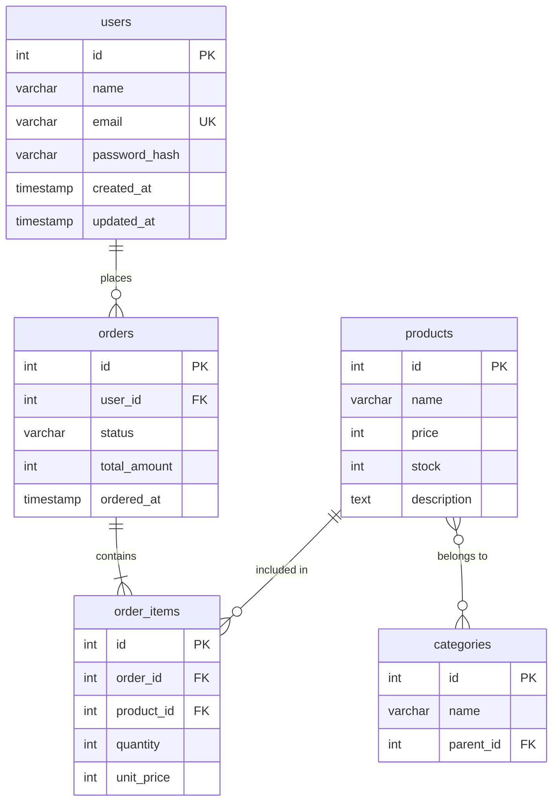

# 第5章：データベース設計書

## この章のゴール

- データベース設計書の目的と構成を理解する
- ER図（Entity-Relationship Diagram）の読み方・書き方を習得する
- テーブル定義書の作成方法を学ぶ
- 正規化の考え方と適用方法を把握する
- インデックス設計の基本を理解する

---

## 5.1 データベース設計書とは

### 目的

データベース設計書は、**システムが扱うデータの構造・関連・制約を定義するドキュメント**です。データはシステムの根幹であり、設計の不備は後から修正するコストが非常に大きくなります。

### データベース設計の流れ

```
概念設計（ER図・概念レベル）
  │  「どんなデータがあるか」
  ▼
論理設計（テーブル定義・正規化）
  │  「どう構造化するか」
  ▼
物理設計（インデックス・パーティション）
     「どう最適化するか」
```

### データベース設計書の構成

```markdown
1. データベース概要
   1.1 使用するDBMS
   1.2 文字コード・照合順序
   1.3 命名規則
2. ER図
   2.1 全体ER図
   2.2 サブシステム別ER図
3. テーブル定義
   3.1 テーブル一覧
   3.2 各テーブルの詳細定義
4. インデックス定義
5. ビュー定義（必要に応じて）
6. データ移行設計（既存システムがある場合）
```

---

## 5.2 命名規則

### テーブル・カラムの命名規則

設計書の冒頭で命名規則を定義しておくと、チーム内で統一された設計ができます。

```markdown
## 命名規則

### 共通ルール
- 英語のスネークケース（小文字 + アンダースコア）を使用する
- 略語は使用しない（name ◯、nm ✕）
- 予約語は使用しない

### テーブル名
- 複数形を使用する（users, orders, products）
- 中間テーブルは「テーブルA_テーブルB」（user_roles）

### カラム名
- 主キー：id
- 外部キー：参照先テーブル名の単数形_id（user_id, product_id）
- 日時：_at 接尾辞（created_at, updated_at, deleted_at）
- フラグ：is_ 接頭辞（is_active, is_deleted）
- 数量・金額：意味が分かる名前（quantity, unit_price, total_amount）
```

> **よくある間違い**: 命名規則を決めずに設計を進めると、`user_id` と `userId` と `uid` が混在するようなテーブルになります。最初に規則を定めましょう。

---

## 5.3 ER図

### ER図とは

ER図（Entity-Relationship Diagram）は、**エンティティ（テーブル）間の関連**を視覚的に表現する図です。

### リレーションシップの種類

```
1対1（One-to-One）：
  ユーザー ──────── ユーザー詳細
  1人のユーザーに1つの詳細情報

1対多（One-to-Many）：
  ユーザー ──────┤ 注文
  1人のユーザーが複数の注文を持つ

多対多（Many-to-Many）：
  商品 ┤────────┤ カテゴリ
  1つの商品が複数のカテゴリに属し、
  1つのカテゴリに複数の商品が属する
  → 中間テーブルで実現
```

### カーディナリティの表記法

```
  ──||──  「1」（必ず1つ）
  ──|O──  「0または1」
  ──|<──  「1以上」
  ──O<──  「0以上」
```

### ECサイトのER図の例

```
┌──────────┐       ┌──────────┐       ┌──────────┐
│  users   │       │  orders  │       │order_items│
├──────────┤       ├──────────┤       ├──────────┤
│*id       │──1:N─→│*id       │──1:N─→│*id       │
│ name     │       │ user_id  │       │ order_id │
│ email    │       │ status   │       │ product_id│
│ password │       │ total    │       │ quantity │
│ created_at│      │ ordered_at│      │ unit_price│
└──────────┘       └──────────┘       └────┬─────┘
                                           │ N:1
                                           ▼
┌──────────┐       ┌───────────────┐  ┌──────────┐
│categories│       │product_categories│ │ products │
├──────────┤       ├───────────────┤  ├──────────┤
│*id       │──N:M─→│*product_id   │←─│*id       │
│ name     │       │*category_id  │  │ name     │
│ parent_id│       └───────────────┘  │ price    │
└──────────┘                          │ stock    │
                                      │ description│
                                      └──────────┘
```

### Mermaid記法でのER図



---

## 5.4 テーブル定義書

### テーブル一覧

| No | テーブル名 | 論理名 | 説明 |
|----|-----------|--------|------|
| 1 | users | ユーザー | 会員情報を管理する |
| 2 | products | 商品 | 商品情報を管理する |
| 3 | categories | カテゴリ | 商品カテゴリを管理する |
| 4 | product_categories | 商品カテゴリ紐付け | 商品とカテゴリの中間テーブル |
| 5 | orders | 注文 | 注文情報を管理する |
| 6 | order_items | 注文明細 | 注文に含まれる商品の明細 |
| 7 | addresses | 配送先住所 | ユーザーの配送先住所を管理する |

### テーブル詳細定義の例

```markdown
## テーブル：users（ユーザー）

### 概要
会員情報を管理するテーブル。

### カラム定義

| No | カラム名 | 論理名 | データ型 | NOT NULL | デフォルト | 説明 |
|----|---------|--------|---------|----------|-----------|------|
| 1 | id | ID | SERIAL | ◯ | 自動採番 | 主キー |
| 2 | name | 氏名 | VARCHAR(100) | ◯ | - | ユーザーの氏名 |
| 3 | email | メールアドレス | VARCHAR(255) | ◯ | - | ログインに使用。一意制約 |
| 4 | password_hash | パスワードハッシュ | VARCHAR(255) | ◯ | - | bcryptハッシュ値 |
| 5 | is_active | 有効フラグ | BOOLEAN | ◯ | true | false=退会済み |
| 6 | created_at | 作成日時 | TIMESTAMP | ◯ | CURRENT_TIMESTAMP | レコード作成日時 |
| 7 | updated_at | 更新日時 | TIMESTAMP | ◯ | CURRENT_TIMESTAMP | レコード更新日時 |

### 制約

| 制約名 | 種類 | カラム | 説明 |
|--------|------|--------|------|
| users_pkey | PRIMARY KEY | id | 主キー |
| users_email_key | UNIQUE | email | メールアドレスの一意制約 |

### インデックス

| インデックス名 | カラム | 種類 | 説明 |
|---------------|--------|------|------|
| users_email_idx | email | UNIQUE | メールアドレスでの検索用 |
| users_created_at_idx | created_at | BTREE | 登録日での並び替え用 |
```

### DDL（テーブル作成SQL）

設計書にDDLを含めると、実装時にそのまま使えて便利です。

```sql
-- ユーザーテーブル
CREATE TABLE users (
    id          SERIAL       PRIMARY KEY,
    name        VARCHAR(100) NOT NULL,
    email       VARCHAR(255) NOT NULL UNIQUE,
    password_hash VARCHAR(255) NOT NULL,
    is_active   BOOLEAN      NOT NULL DEFAULT true,
    created_at  TIMESTAMP    NOT NULL DEFAULT CURRENT_TIMESTAMP,
    updated_at  TIMESTAMP    NOT NULL DEFAULT CURRENT_TIMESTAMP
);

-- インデックス
CREATE INDEX users_created_at_idx ON users (created_at);

-- 注文テーブル
CREATE TABLE orders (
    id          SERIAL       PRIMARY KEY,
    user_id     INTEGER      NOT NULL REFERENCES users(id),
    status      VARCHAR(20)  NOT NULL DEFAULT 'pending',
    total_amount INTEGER     NOT NULL,
    ordered_at  TIMESTAMP    NOT NULL DEFAULT CURRENT_TIMESTAMP,
    created_at  TIMESTAMP    NOT NULL DEFAULT CURRENT_TIMESTAMP,
    updated_at  TIMESTAMP    NOT NULL DEFAULT CURRENT_TIMESTAMP
);

-- インデックス
CREATE INDEX orders_user_id_idx ON orders (user_id);
CREATE INDEX orders_status_idx ON orders (status);
CREATE INDEX orders_ordered_at_idx ON orders (ordered_at);

-- 注文明細テーブル
CREATE TABLE order_items (
    id          SERIAL       PRIMARY KEY,
    order_id    INTEGER      NOT NULL REFERENCES orders(id),
    product_id  INTEGER      NOT NULL REFERENCES products(id),
    quantity    INTEGER      NOT NULL CHECK (quantity > 0),
    unit_price  INTEGER      NOT NULL CHECK (unit_price >= 0),
    created_at  TIMESTAMP    NOT NULL DEFAULT CURRENT_TIMESTAMP
);

-- インデックス
CREATE INDEX order_items_order_id_idx ON order_items (order_id);
```

---

## 5.5 正規化

### 正規化とは

正規化（Normalization）は、**データの冗長性を排除し、整合性を保つ**ためのテーブル分割の手法です。

### 正規化の段階

**第1正規形（1NF）：繰り返しグループの排除**

```
【非正規形】
注文ID | 商品1  | 数量1 | 商品2  | 数量2
  1    | りんご |   3   | みかん |   5

  ↓ 第1正規形に変換

【第1正規形】
注文ID | 商品    | 数量
  1    | りんご  |  3
  1    | みかん  |  5
```

**第2正規形（2NF）：部分関数従属の排除**

```
【第1正規形】
注文ID | 商品ID | 商品名  | 数量
  1    |  P001  | りんご  |  3

  商品名は商品IDだけで決まる（注文IDに依存しない）
  ↓ テーブルを分割

【第2正規形】
注文明細：注文ID | 商品ID | 数量
商品：    商品ID | 商品名
```

**第3正規形（3NF）：推移的関数従属の排除**

```
【第2正規形】
社員ID | 部署ID | 部署名
  E001 |  D01   | 営業部

  部署名は部署IDで決まる（社員IDに直接依存しない）
  ↓ テーブルを分割

【第3正規形】
社員：社員ID | 部署ID
部署：部署ID | 部署名
```

### 正規化のまとめ

| 正規形 | ルール | 排除する問題 |
|--------|--------|------------|
| 第1正規形 | 繰り返しグループなし | 1セルに複数値 |
| 第2正規形 | 部分関数従属なし | 複合キーの一部にだけ依存するカラム |
| 第3正規形 | 推移的関数従属なし | キー以外のカラムに依存するカラム |

> **実務でのポイント**: 基本的に第3正規形まで正規化しますが、パフォーマンスのために意図的に非正規化（冗長化）する場合もあります。その場合は「なぜ非正規化するか」を設計書に明記します。

---

## 5.6 インデックス設計

### インデックスが必要なケース

| ケース | 例 |
|--------|-----|
| WHERE句でよく検索するカラム | `WHERE status = 'active'` |
| JOIN条件のカラム | `JOIN orders ON users.id = orders.user_id` |
| ORDER BYで並び替えるカラム | `ORDER BY created_at DESC` |
| 一意制約が必要なカラム | `email` のユニーク制約 |

### インデックスが不要なケース

| ケース | 理由 |
|--------|------|
| レコード数が少ないテーブル | フルスキャンの方が速い |
| INSERT/UPDATEが非常に多いテーブル | インデックス更新のオーバーヘッド |
| カーディナリティが低いカラム | true/false のようなカラムは効果が薄い |

### 複合インデックスの設計

```sql
-- 検索パターン：注文一覧を「ユーザーID」かつ「注文日」で検索
SELECT * FROM orders
WHERE user_id = 1
ORDER BY ordered_at DESC;

-- 複合インデックス（左端のカラムから順に利用される）
CREATE INDEX orders_user_ordered_idx
ON orders (user_id, ordered_at DESC);
```

> **よくある間違い**: 「とりあえず全カラムにインデックスを張る」のは逆効果です。書き込みが遅くなり、ストレージも無駄に消費します。実際のクエリパターンに基づいて必要なインデックスだけを設計しましょう。

---

## まとめ

| 概念 | ポイント |
|------|---------|
| DB設計書 | データの構造・関連・制約を定義するドキュメント |
| 命名規則 | スネークケース、複数形テーブル名などのルールを最初に決める |
| ER図 | エンティティ間のリレーションシップを視覚的に表現する |
| テーブル定義書 | カラム名・型・制約・インデックスを詳細に定義する |
| 正規化 | 第3正規形まで正規化し、必要に応じて非正規化する |
| インデックス | クエリパターンに基づいて必要なインデックスを設計する |

---

## 次章の予告

次章では、ユーザーが直接触れる部分である「画面設計書・UI設計」の作成方法を学びます。ワイヤーフレーム、画面レイアウト、入力バリデーションの定義方法を解説します。
